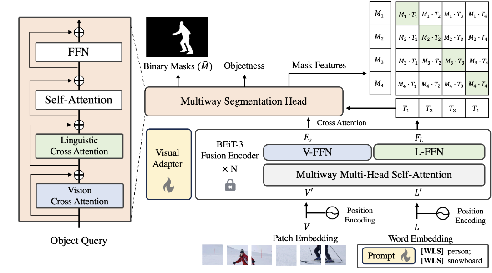

# OMTSeg: Open-Vocabulary Panoptic Segmentation Using BERT Pre-Training of Vision-Language Multiway Transformer Model
[](https://ieeexplore.ieee.org/abstract/document/10647459) [](./LICENSE)

Official implementation of our ICIP 2024 paper:
"Open-Vocabulary Panoptic Segmentation Using BERT Pre-Training of Vision-Language Multiway Transformer Model".

## 📄 Abstract

Open-vocabulary panoptic segmentation remains a challenging problem. One of the biggest difficulties lies in training models to generalize to an unlimited number of classes using limited categorized training data. Recent popular methods involve large-scale vision-language pre-trained foundation models, such as CLIP. In this paper, we propose OMTSeg for open-vocabulary segmentation using another large-scale vision-language pre-trained model called BEiT-3 and leveraging the cross-modal attention between visual and linguistic features in BEiT-3 to achieve better performance. Experiments result demonstrates that OMTSeg performs favorably against state-of-the-art models.

## 🚀 Overview

<p align="center">
  
</p>

## Citation

If you find this work useful in your research, please cite our paper:

```
@inproceedings{chen2024open,
  title={Open-Vocabulary Panoptic Segmentation Using Bert Pre-Training of Vision-Language Multiway Transformer Model},
  author={Chen, Yi-Chia and Li, Wei-Hua and Chen, Chu-Song},
  booktitle={2024 IEEE International Conference on Image Processing (ICIP)},
  pages={2494--2500},
  year={2024},
  organization={IEEE}
}
```


## License

This project is released under a custom license.  
Please see the [LICENSE](./LICENSE) file for the full terms and conditions.

For academic or commercial use, please contact the authors.


